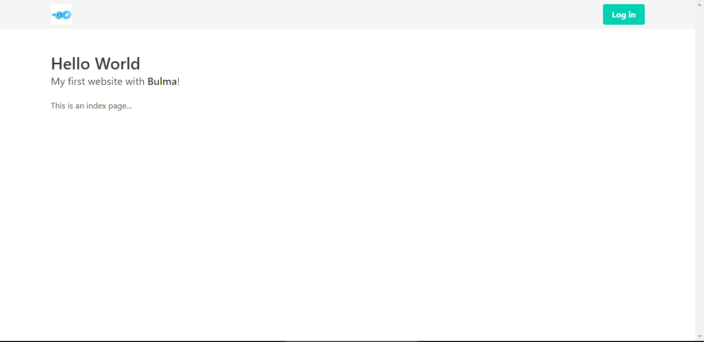

# Hectagon-challenge


## Golang basic
This directory contains the main.go file containing all the functions in the go basic section

## Git basic
This directory contains the file 'git basic.doc' containing all the answers in the git basic section


## Chat app realtime

Flow:


Requirement:
* [Visual studio code](https://code.visualstudio.com/download)
* [Go](https://go.dev/)
* [NodeJs](https://nodejs.org/en/)

How to run: 

```go
cd backend
go run main.go
```

```cmd
cd frontend
npm start
```

> ### *Link app: http://localhost:3000/*

App after being run successfully:

