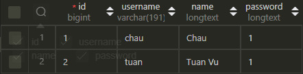
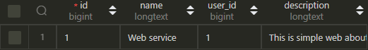
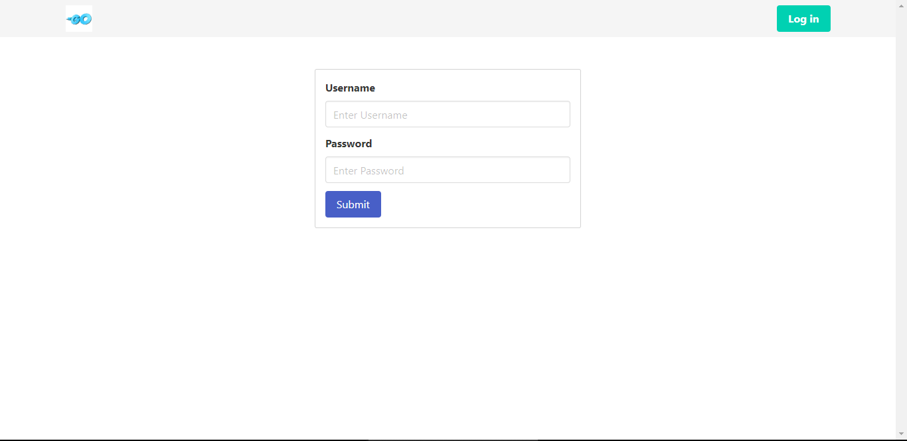

# Hectagon-challenge

## Golang basic
This directory contains the main.go file containing all the functions in the go basic section

## Git basic
This directory contains the file 'git basic.doc' containing all the answers in the git basic section


## Golang app
Requirement:
* [Visual studio code](https://code.visualstudio.com/download)
* [Go](https://go.dev/)
* [MySQL](https://dev.mysql.com/downloads/installer/)

Set up and run:

* Step 1: Create database in MySQL with name: `your_database_name` and go to the file `database/database.go` and change the database name to your database name


    ```go
    connection, err := gorm.Open(mysql.Open("username:password@/your_database_name"), &gorm.Config{})
    ```
    And you run follow this command:

    ```go
    go run main.go
    ```
    The program will automatically create a table in the database for you

* Step 2: Run MySQL Workbench and create a new user, repository and commit follow this form.

    Users:
    
    
    
    Repositories:
    
    
    
    Commits:
    
    

* Step 3: Run the app by following the command:
    
    ```go
    go run main.go
    ```

    > ### *Link app: http://localhost:8080/*


    App after being run successfully:
    

    Click on the button `Login` to login to the app

    
    
    After that, you can see the list of repositories and commits of the user you just logged in
